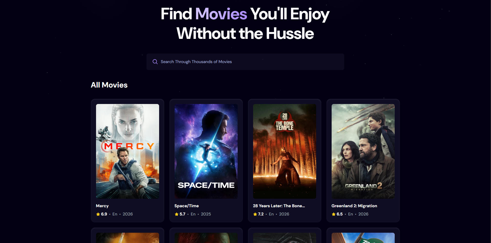

# 🎬 Movie Trend App

A modern React application that displays trending movies in real-time using the TMDB API.  
Users can browse popular movies and search the entire database with a debounced search experience for optimized performance.

🔗 **Live Demo:** https://movie-app-trends.netlify.app/  
📂 **Repository:** https://github.com/ahmed-skaik/movie-trend-app  

---

## 📌 About The Project

Movie Trend App is a production-ready frontend application built with **React** and **Vite**.  
It consumes real-time data from the TMDB API and presents it in a clean, responsive interface.

The application allows users to:

- Browse trending movies sorted by popularity  
- View movie ratings, original language, and release year  
- Search across the TMDB database  
- Experience optimized API requests using input debouncing  

This project emphasizes:

- Clean component structure  
- Efficient API integration  
- Performance optimization  
- Secure environment variable handling  
- Production deployment  

---

## 🚀 Features

- 🎥 Real-time trending movies  
- ⭐ Movie ratings and metadata  
- 🔍 Search functionality  
- ⏱ Debounced search input (reduces unnecessary API calls)  
- 🌙 Modern dark-themed UI  
- 📱 Responsive design  
- 🌍 Deployed on Netlify  
- 🔐 Secure API key management  

---

## 🛠 Tech Stack

- React  
- Vite  
- JavaScript (ES6+)  
- CSS  
- Tailwind CSS  
- TMDB API  
- Netlify  

---

## ⚙️ Environment Variables

This project requires a TMDB API key.

Create a `.env` file in the root directory:

```env
VITE_TMDB_API_KEY=your_tmdb_api_key_here
```

For production (Netlify), add the same variable inside:

Site Configuration → Environment Variables

---

## 📦 Installation

Clone the repository:

```bash
git clone https://github.com/ahmed-skaik/movie-trend-app.git
cd movie-trend-app
```

Install dependencies:

```bash
npm install
```

Run development server:

```bash
npm run dev
```

Build for production:

```bash
npm run build
```

---

## 🧠 Implementation Details

### API Integration
Movies are fetched from TMDB discover and search endpoints using `fetch`.

### Debounced Search
The search input uses a debouncing technique to delay API calls until the user stops typing.  
This improves performance and prevents excessive network requests.

### Image Handling
Movie posters are dynamically loaded using TMDB’s image base URL.

### Deployment
The application is deployed on Netlify using:

- Vite production build  
- `dist` as publish directory  
- Environment variables configured in Netlify dashboard  

---

## 📸 Preview



---

## 🎯 What This Project Demonstrates

- Practical API consumption  
- React state management  
- Performance optimization techniques  
- Production debugging (case-sensitive imports, environment variables)  
- Clean UI structure  

---

## 👨‍💻 Author

Ahmed Skaîk  
GitHub: https://github.com/ahmed-skaik  

---

## 📄 License

This project is for educational and portfolio purposes.